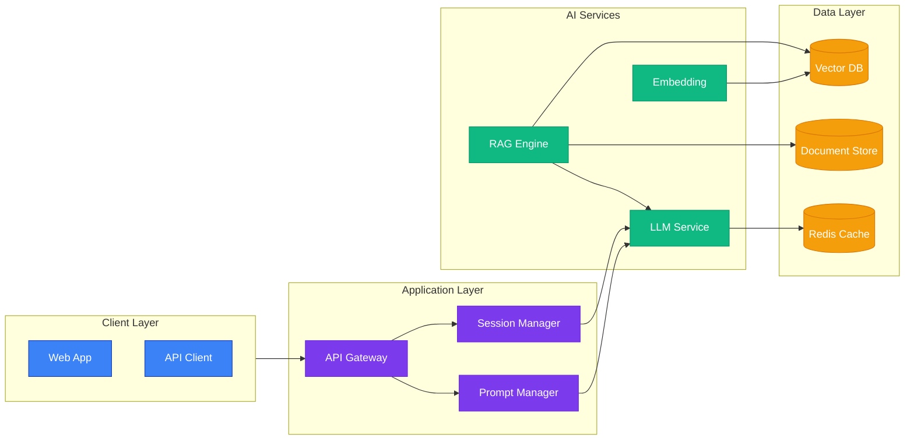
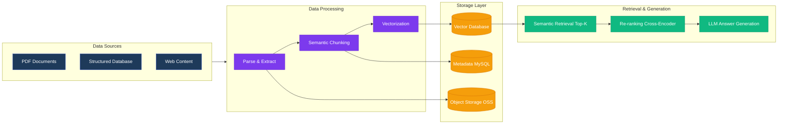
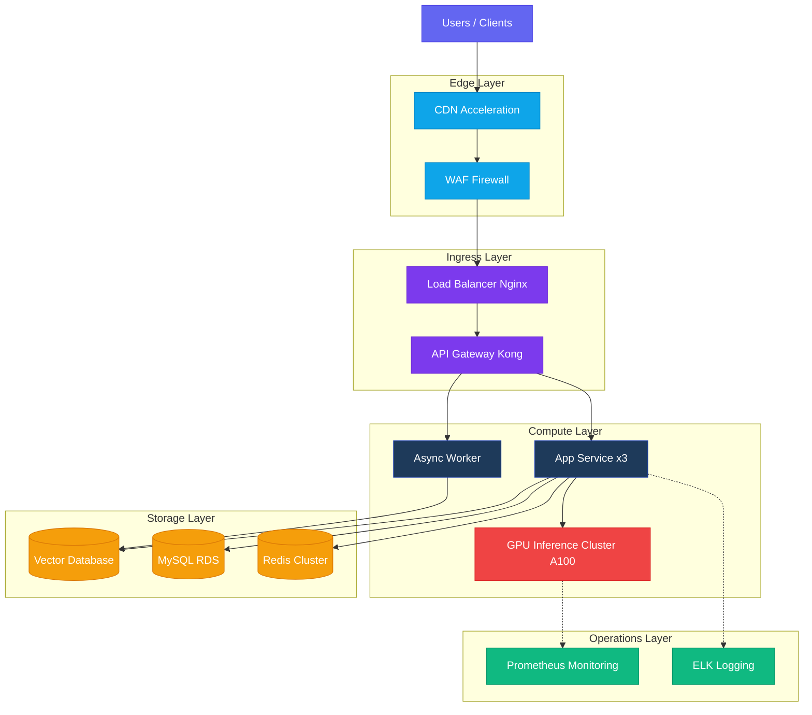
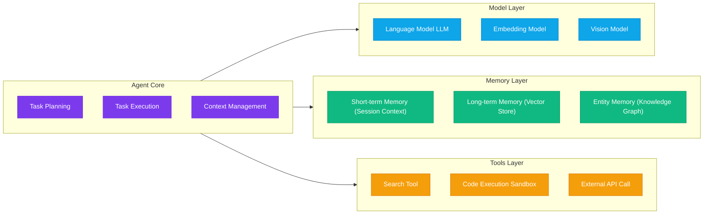
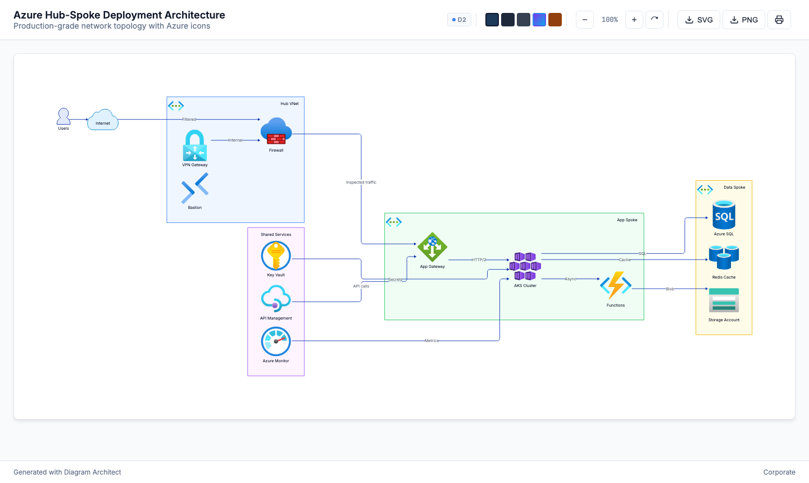

# diagram-architect.skill

**[中文](README.zh.md)** · English

A production-grade diagram generation skill for **Claude Code**. Describe your architecture in plain text and get a beautiful, self-contained HTML file — 5 professional themes, interactive zoom/export controls, zero runtime dependencies.

## What It Does

Once installed, the skill lets Claude Code understand requests like "draw an XX architecture diagram", choose the right diagram type and theme, and automatically write a `.html` file you can open directly in any browser.

---

## 4 AI Architecture Examples

The following four examples cover the most common AI system architecture scenarios, demonstrating the skill across different architectural dimensions.

---

### 1. Application Architecture

**What it shows**: Complete layering from client to LLM service, illustrating each layer's components and interactions in a RAG Q&A platform.
**Use cases**: System design reviews, technical proposal discussions, new-hire onboarding documentation.

**Prompt example:**
```
Draw an application architecture diagram for a RAG Q&A platform, using Tech theme
```

**Diagram code:**


**Validation:**

| Dimension | Result |
|-----------|--------|
| Layer clarity | ✅ 4 layers (Client → App → AI Services → Data) logically isolated |
| Critical path | ✅ User request → API Gateway → RAG Engine → LLM fully traceable |
| Data flow | ✅ Vectorization, storage, and cache read/write directions correct |
| Recommended theme | Tech (purple) highlights AI product identity |

---

### 2. Data Architecture

**What it shows**: Full data journey from ingestion and processing to RAG retrieval and generation, illustrating processing logic and storage targets at each stage.
**Use cases**: Data governance design, ETL pipeline planning, data team alignment.

**Prompt example:**
```
Generate a data processing pipeline architecture diagram for an AI knowledge base system
```

**Diagram code:**


**Validation:**

| Dimension | Result |
|-----------|--------|
| Data flow direction | ✅ Left to right, unidirectional, no cycles |
| Stage separation | ✅ ETL three steps (parse → chunk → vectorize) clearly laid out |
| Storage targets explicit | ✅ Vectors, raw text, and metadata written to separate stores |
| Retrieval pipeline | ✅ Two-stage retrieval (recall + re-ranking) follows RAG best practices |

---

### 3. Deployment Architecture

**What it shows**: Complete production deployment topology for an AI inference service, from edge CDN to GPU compute cluster and operations monitoring.
**Use cases**: Operations architecture design, capacity planning, security review, go-live checklist.

**Prompt example:**
```
Draw a deployment architecture diagram for a production AI inference service, including GPU cluster and operations monitoring layer
```

**Diagram code:**


**Validation:**

| Dimension | Result |
|-----------|--------|
| Traffic path | ✅ Users → CDN → WAF → LB → Gateway complete chain |
| High availability | ✅ App service ×3 replicas, GPU cluster scales independently |
| Monitoring coverage | ✅ Dashed lines denote monitoring collection, distinct from data flow |
| Storage isolation | ✅ Vector / relational / cache stores each serve dedicated roles |

---

### 4. Module Architecture

**What it shows**: Core module composition and dependencies within an AI Agent framework, illustrating responsibility boundaries across Agent Core, Model Layer, Memory Layer, and Tools Layer.
**Use cases**: Module design documents, interface specification, code architecture review.

**Prompt example:**
```
Draw an AI Agent framework module architecture diagram using Dark Mode theme
```

**Diagram code:**


**Validation:**

| Dimension | Result |
|-----------|--------|
| Module responsibility | ✅ 4 subsystems each cohesive with clear boundaries |
| Dependency direction | ✅ Agent Core is the single entry point, one-way dependency on three layers |
| Extensibility | ✅ Tools Layer and Model Layer can scale horizontally and independently |
| Recommended theme | Dark Mode suits developer docs and IDE environments |

---

### 5. Azure Deployment Architecture (with Cloud Icons)

**What it shows**: Production Hub-Spoke network topology on Azure with real service icons — VNet boundaries, Firewall, AKS, App Gateway, Key Vault, SQL, Redis and more.
**Use cases**: Cloud architecture reviews, infrastructure planning, network security design, Azure adoption documentation.

**Prompt example:**
```
Draw an Azure Hub-Spoke deployment architecture diagram with network security and shared services
```

**Result:**



**Key feature:** Use `@azure:ALIAS` in D2 source — `generate.py` automatically embeds the SVG as a base64 data URI, keeping the HTML fully self-contained with no internet dependency for icons.

```d2
hub: Hub VNet {
  icon: "@azure:vnet"

  fw: Firewall {
    icon: "@azure:firewall"
    shape: image
  }
  vpn: VPN Gateway {
    icon: "@azure:vpn-gateway"
    shape: image
  }
}

spoke: App Spoke {
  aks: AKS Cluster {
    icon: "@azure:kubernetes"
    shape: image
  }
}
```

**43 built-in Azure icons** — see [references/azure-icons.md](references/azure-icons.md) for the full catalog.

---

## Features

| Feature | Description |
|---------|-------------|
| **Diagram Types** | Flowchart, Sequence, ER, State, Class, Mind Map, Gantt, C4 Architecture |
| **Rendering Engines** | Mermaid.js (CDN, zero dependencies), D2 (kroki.io API), PlantUML/C4 (kroki.io API) |
| **Azure Cloud Icons** | 43 built-in Azure service icons — use `@azure:ALIAS` in D2 diagrams, auto-embedded as base64 |
| **Theme System** | Corporate, Dark Mode, Minimal, Tech, Warm — runtime switching, no re-generation needed |
| **Interactive Controls** | Zoom (25%–300%), drag-to-pan (mouse + touch), keyboard shortcuts |
| **Export Formats** | SVG vector, 2× Retina PNG, print-optimized layout |
| **Output Format** | Single self-contained `.html` file, no server required, opens in any browser |

## Installation

### Option 1: Install `.skill` file (Recommended)

```bash
# Download the latest release
curl -L https://github.com/lohasle/diagram-architect.skill/releases/latest/download/diagram-architect.skill \
  -o ~/.claude/skills/diagram-architect.skill
# Claude Code auto-discovers it on next launch — no further configuration needed
```

### Option 2: Clone from Git

```bash
cd ~/.claude/skills
git clone https://github.com/lohasle/diagram-architect.skill.git diagram-architect

# Update later with:
cd diagram-architect && git pull
```

## Theme System

| Theme | Primary Color | Best For |
|-------|---------------|----------|
| **Corporate** | Navy `#1e3a5a` | Enterprise architecture, B2B docs, technical reviews |
| **Dark Mode** | Slate `#1e293b` | Developer docs, API specs, IDE screenshots |
| **Minimal** | Gray `#374151` | White papers, academic materials, formal reports |
| **Tech** | Purple `#7c3aed` | AI products, SaaS platforms, tech blogs |
| **Warm** | Amber `#92400e` | Tutorials, training materials, approachable docs |

Generated HTML files include a built-in theme switcher — change themes at runtime without re-generating.

## Engine Selection

```
Need a C4 architecture diagram?      → PlantUML (via kroki.io)
Infrastructure / cloud deployment?   → D2 (via kroki.io or local CLI)
All other diagram types?             → Mermaid.js (CDN, zero dependencies) ✓ default
```

## Keyboard Shortcuts (in generated HTML)

| Shortcut | Action |
|----------|--------|
| `Ctrl/Cmd +` | Zoom in |
| `Ctrl/Cmd -` | Zoom out |
| `Ctrl/Cmd 0` | Reset view |
| `Ctrl/Cmd P` | Print |

## Project Structure

```
diagram-architect/
├── SKILL.md                       # Claude Code skill definition
├── assets/
│   ├── icons/
│   │   └── azure/                 # 43 Azure service SVG icons (vm, kubernetes, vnet, ...)
│   ├── screenshots/               # Demo screenshots
│   └── templates/
│       └── diagram.html           # Self-contained HTML template (includes Mermaid.js CDN)
├── references/
│   ├── engine-selection.md        # Engine selection decision tree
│   ├── mermaid-patterns.md        # Mermaid syntax and examples
│   ├── d2-patterns.md             # D2 syntax and infrastructure diagram examples
│   ├── plantuml-c4.md             # C4 model and PlantUML
│   ├── azure-icons.md             # Azure icon catalog (@azure:ALIAS usage)
│   ├── design-principles.md       # Diagram design principles and anti-patterns
│   └── themes.md                  # Color definitions for all 5 themes
└── scripts/
    ├── generate.py                # Generate HTML from template; resolves @azure: icons
    └── render.py                  # D2/PlantUML → SVG (via kroki.io API)
```

## Requirements

- **Claude Code** v2.0+ (skills feature support)
- **Browser** — any modern browser to view generated HTML
- **D2/PlantUML rendering** (optional): `pip install requests`

## License

MIT

---

> Built for [Claude Code](https://claude.ai/code) · Powered by [Mermaid.js](https://mermaid.js.org), [D2](https://d2lang.com), [PlantUML](https://plantuml.com), [kroki.io](https://kroki.io)
