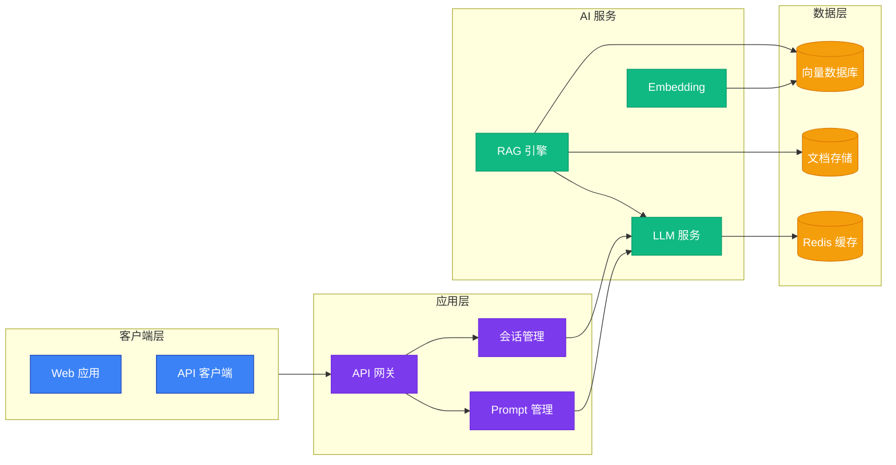
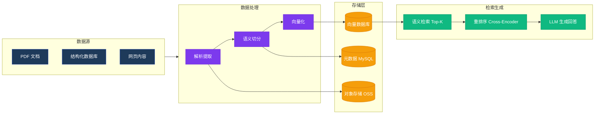
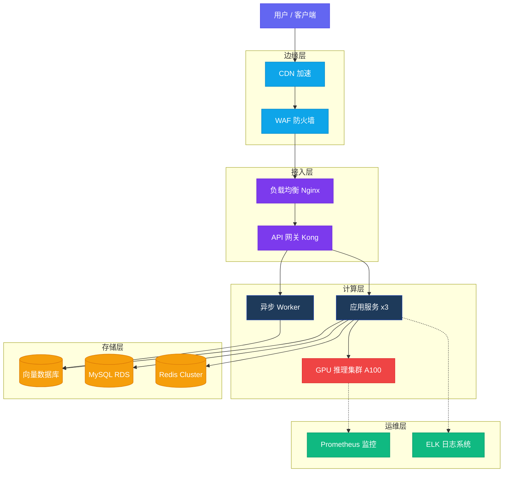
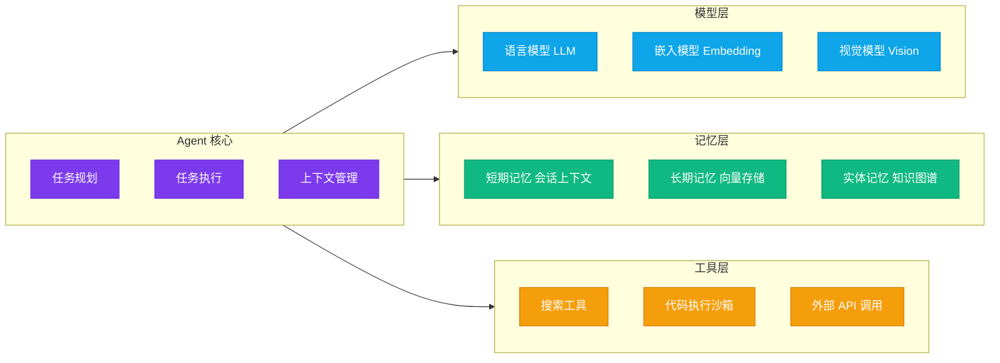

# diagram-architect.skill

**中文** · [English](README.md)

一个用于 **Claude Code** 的生产级架构图生成技能。通过自然语言描述，自动生成美观的自包含 HTML 图表文件——内置 5 套专业主题、交互式缩放/导出控件，零运行时依赖。

## 能做什么

安装后，该技能让 Claude Code 能理解"画一张 XX 架构图"这类请求，选择合适的图表类型和主题，自动写出可在浏览器直接打开的 `.html` 文件。

---

## 四类 AI 架构图示例

以下四个示例覆盖 AI 系统最常见的架构描述场景，验证了技能在不同架构维度下的表现。

---

### 1. 应用架构

**描述什么**：从客户端到 LLM 服务的完整分层，展示 RAG 问答平台各层组件及交互关系。
**适用场景**：系统设计评审、技术方案讨论、新人 Onboarding 文档。

**Prompt 示例：**
```
画一个 RAG 问答平台的应用架构图，使用 Tech 主题
```

**图表代码：**


**验证说明：**

| 维度 | 结果 |
|------|------|
| 分层清晰度 | ✅ 4 层（客户端 → 应用 → AI 服务 → 数据）逻辑隔离 |
| 关键路径 | ✅ 用户请求 → API 网关 → RAG 引擎 → LLM 完整可追踪 |
| 数据流向 | ✅ 向量化、存储、缓存的写入/读取方向正确 |
| 适用主题 | Tech（紫色系）突显 AI 产品属性 |

---

### 2. 数据架构

**描述什么**：数据从采集、处理到 RAG 检索生成的全链路流转，展示每个阶段的处理逻辑和存储目标。
**适用场景**：数据治理设计、ETL 流程规划、数据团队对齐。

**Prompt 示例：**
```
生成 AI 知识库系统的数据处理流水线架构图
```

**图表代码：**


**验证说明：**

| 维度 | 结果 |
|------|------|
| 数据流向 | ✅ 从左至右，单向流动，无回路 |
| 分阶段处理 | ✅ ETL 三步（解析 → 切分 → 向量化）清晰展开 |
| 存储目标明确 | ✅ 向量、原始文本、元数据分别写入不同存储 |
| 检索链路 | ✅ 双阶段检索（召回 + 重排序）符合 RAG 最佳实践 |

---

### 3. 部署架构

**描述什么**：生产环境下 AI 推理服务的完整部署拓扑，从边缘 CDN 到 GPU 计算集群及运维监控。
**适用场景**：运维架构设计、容量规划、安全评审、上线 Checklist。

**Prompt 示例：**
```
画出生产环境 AI 推理服务的部署架构图，包含 GPU 集群和运维监控层
```

**图表代码：**


**验证说明：**

| 维度 | 结果 |
|------|------|
| 流量路径 | ✅ 用户 → CDN → WAF → LB → 网关 完整链路 |
| 高可用设计 | ✅ 应用服务 ×3 副本，GPU 集群独立扩展 |
| 监控覆盖 | ✅ 虚线表示监控采集链路，区别于业务数据链路 |
| 存储隔离 | ✅ 向量/关系/缓存三种存储各司其职 |

---

### 4. 模块架构

**描述什么**：AI Agent 框架中各核心模块的组成与依赖关系，展示 Agent 核心、模型层、记忆层和工具层的职责划分。
**适用场景**：模块设计文档、接口规范制定、代码架构评审。

**Prompt 示例：**
```
绘制 AI Agent 框架的模块架构图，使用 Dark Mode 主题
```

**图表代码：**


**验证说明：**

| 维度 | 结果 |
|------|------|
| 模块职责清晰 | ✅ 4 个子系统各自内聚，边界明确 |
| 依赖方向 | ✅ Agent 核心为统一入口，单向依赖三层 |
| 扩展性 | ✅ 工具层和模型层均可独立水平扩展 |
| 适用主题 | Dark Mode 适合开发者文档和 IDE 环境 |

---

## 功能特性

| 特性 | 说明 |
|------|------|
| **图表类型** | 流程图、时序图、ER 图、状态图、类图、思维导图、甘特图、C4 架构图 |
| **渲染引擎** | Mermaid.js（CDN 零依赖）、D2（kroki.io API）、PlantUML/C4（kroki.io API） |
| **主题系统** | Corporate、Dark Mode、Minimal、Tech、Warm — 运行时切换，无需重新生成 |
| **交互控件** | 缩放（25%–300%）、鼠标拖拽平移、触控拖拽、键盘快捷键 |
| **导出格式** | SVG 矢量图、2× Retina PNG、打印优化布局 |
| **输出格式** | 单个自包含 `.html` 文件，无需服务器，任意浏览器打开 |

## 安装方法

### 方式一：安装 `.skill` 文件（推荐）

```bash
# 下载最新版本
curl -L https://github.com/lohasle/diagram-architect.skill/releases/latest/download/diagram-architect.skill \
  -o ~/.claude/skills/diagram-architect.skill
# Claude Code 下次启动时自动识别，无需额外配置
```

### 方式二：Git Clone 源目录

```bash
cd ~/.claude/skills
git clone https://github.com/lohasle/diagram-architect.skill.git diagram-architect

# 后续更新
cd diagram-architect && git pull
```

## 主题系统

| 主题 | 主色调 | 适用场景 |
|------|--------|----------|
| **Corporate** | 藏青 `#1e3a5a` | 企业架构、B2B 文档、技术评审 |
| **Dark Mode** | 深灰 `#1e293b` | 开发者文档、API 规范、IDE 截图 |
| **Minimal** | 灰色 `#374151` | 白皮书、学术材料、正式报告 |
| **Tech** | 紫色 `#7c3aed` | AI 产品、SaaS、技术博客 |
| **Warm** | 琥珀 `#92400e` | 教程、培训材料、友好文档 |

生成的 HTML 文件内置主题切换按钮，运行时切换无需重新生成。

## 引擎选择

```
需要 C4 架构图？       → PlantUML（通过 kroki.io）
基础设施 / 云部署图？  → D2（通过 kroki.io 或本地 CLI）
其他所有图表类型？      → Mermaid.js（CDN，零依赖）✓ 默认
```

## 快捷键（在生成的 HTML 中）

| 快捷键 | 操作 |
|--------|------|
| `Ctrl/Cmd +` | 放大 |
| `Ctrl/Cmd -` | 缩小 |
| `Ctrl/Cmd 0` | 重置视图 |
| `Ctrl/Cmd P` | 打印 |

## 项目结构

```
diagram-architect/
├── SKILL.md                       # Claude Code 技能定义文件
├── assets/
│   └── templates/
│       └── diagram.html           # 自包含 HTML 模板（含 Mermaid.js CDN）
├── references/
│   ├── engine-selection.md        # 引擎选择决策树
│   ├── mermaid-patterns.md        # Mermaid 语法与示例
│   ├── d2-patterns.md             # D2 语法与基础设施图案例
│   ├── plantuml-c4.md             # C4 模型与 PlantUML
│   ├── design-principles.md       # 图表设计原则与反模式
│   └── themes.md                  # 5 套主题的颜色定义
└── scripts/
    └── render.py                  # D2/PlantUML → SVG（通过 kroki.io API）
```

## 依赖要求

- **Claude Code** v2.0+（支持 skills 功能）
- **浏览器** — 任意现代浏览器均可查看生成的 HTML
- **D2/PlantUML 渲染**（可选）：`pip install requests`

## 许可证

MIT

---

> 为 [Claude Code](https://claude.ai/code) 构建 · 基于 [Mermaid.js](https://mermaid.js.org)、[D2](https://d2lang.com)、[PlantUML](https://plantuml.com)、[kroki.io](https://kroki.io)
