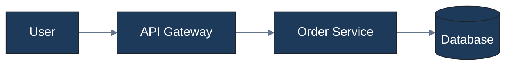
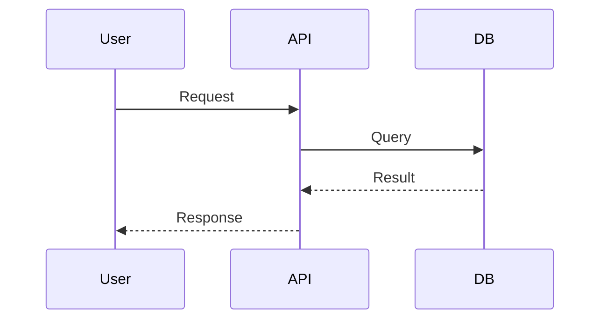
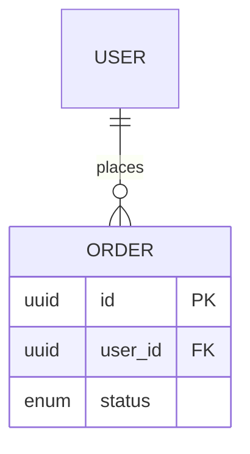
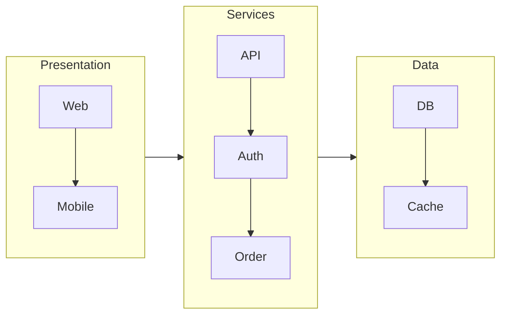
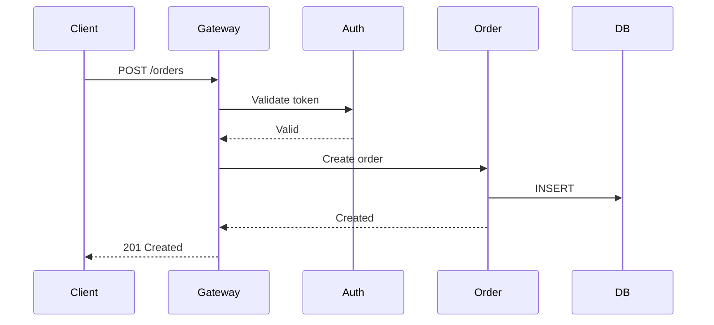

# Diagram Architect

Production-grade diagram generation with beautiful, professional themes. Creates self-contained HTML files that open in any browser with zero dependencies.

## Quick Start

```bash
# Locate the HTML template (skill-relative path)
# assets/templates/diagram.html

# Generate a diagram: copy the template, then replace placeholders:
# - DIAGRAM_TITLE    → Main heading (e.g., "CMP Platform Architecture")
# - DIAGRAM_SUBTITLE → Optional subtitle or description
# - DIAGRAM_SOURCE   → Mermaid diagram source code

# Output: save as <name>.html (e.g., architecture.html)
```

## Engine Selection

Choose the rendering engine based on your needs:

| Use Case | Engine | Method |
|-----------|---------|---------|
| Most diagrams | Mermaid.js | CDN (zero dependency) |
| Infrastructure/Cloud layouts | D2 | CLI or kroki.io API |
| C4 Architecture | PlantUML | kroki.io API |

See [references/engine-selection.md](references/engine-selection.md) for detailed guidance.

## Workflow

### 1. Understand the Request
- Identify diagram type (flowchart, sequence, ER, architecture, etc.)
- Identify audience (technical, business, mixed)
- Identify purpose (overview, deep dive, decision support)

### 2. Select Engine
- **Mermaid.js** - Default choice, 10+ diagram types, zero dependency
- **D2** - Infrastructure diagrams, requires CLI or API
- **PlantUML** - C4 architecture, use kroki.io API

### 3. Apply Design Principles
- Limit nodes: Context <10, Container <20, Component <30
- Use logical grouping with subgraphs
- Clear labels: Noun phrases for systems, role names for people
- Consistent styling: Use theme colors, avoid default Mermaid styles

See [references/design-principles.md](references/design-principles.md) for guidelines.

### 4. Choose Theme

| Theme | Primary Color | Use Case |
|--------|---------------|-----------|
| Corporate | #1e3a5a (Navy) | Enterprise, B2B |
| Dark Mode | #1e293b (Dark) | Dev docs, IDE-like |
| Minimal | #374151 (Gray) | White papers, academic |
| Tech | #7c3aed (Purple) | Startups, AI/ML |
| Warm | #92400e (Brown) | Tutorials, education |

See [references/themes.md](references/themes.md) for full theme definitions.

### 5. Generate Diagram Code

**Mermaid Flowchart:**


**Sequence Diagram:**


**ER Diagram:**


### 6. Wrap in HTML Template

Replace placeholders in the template:
- `DIAGRAM_TITLE` - Main heading
- `DIAGRAM_SUBTITLE` - Optional subtitle
- `DIAGRAM_SOURCE` - Mermaid/D2/PlantUML source code

Example transformation:
```html
<!-- Template -->
<h1 class="diagram-title" id="diagram-title">DIAGRAM_TITLE</h1>
<div class="mermaid">DIAGRAM_SOURCE</div>

<!-- Generated -->
<h1 class="diagram-title" id="diagram-title">CMP Platform Architecture</h1>
<div class="mermaid">
flowchart LR
    CMP[Platform] --> DMP[DMP]
    CMP --> Cloud[IoT Cloud]
</div>
```

## Reference Patterns

### Mermaid Patterns
See [references/mermaid-patterns.md](references/mermaid-patterns.md) for:
- Flowchart syntax and styling
- Sequence diagram messages and activations
- ER diagram cardinalities
- State diagram transitions
- Quality examples (bad/good/excellent)

### D2 Patterns
See [references/d2-patterns.md](references/d2-patterns.md) for:
- Infrastructure diagram patterns
- Cloud deployment layouts
- SQL class syntax for styling
- kroki.io API usage

### PlantUML C4 Patterns
See [references/plantuml-c4.md](references/plantuml-c4.md) for:
- C4 model (Context/Container/Component)
- C4-PlantUML library includes
- IoT platform architecture template
- kroki.io API rendering

## HTML Template Features

The template at `assets/templates/diagram.html` includes:

### Interactive Controls
- **Theme switcher** - 5 professional themes
- **Zoom in/out** - Scale 25% to 300%
- **Reset view** - Return to 100% and center
- **Export SVG** - Download vector format
- **Export PNG** - Download raster image
- **Print** - Print-optimized layout

### Keyboard Shortcuts
- `Ctrl/Cmd +` - Zoom in
- `Ctrl/Cmd -` - Zoom out
- `Ctrl/Cmd 0` - Reset view
- `Ctrl/Cmd P` - Print

### Drag to Pan
Click and drag on the diagram to pan large diagrams.

### Responsive Design
- Mobile-friendly controls
- Auto-adjusts to screen size
- Print styles for clean output

## Quality Checklist

Before delivering a diagram, verify:

- [ ] Does it answer one clear question?
- [ ] Are node counts within limits?
- [ ] Is text readable at 100% zoom?
- [ ] Are colors applied from the theme?
- [ ] Would the target audience understand it?
- [ ] Does it work in grayscale (for printing)?
- [ ] Are related elements grouped?

## Common Patterns

### System Architecture
Use Mermaid flowchart with subgraphs for layers:


### API Flow
Use Mermaid sequence:


### C4 Architecture
Use PlantUML with C4 library:
```plantuml
@startuml
!include https://raw.githubusercontent.com/plantuml-stdlib/C4-PlantUML/master/C4_Container.puml
Person(user, "User")
Container(api, "API", "Node.js")
ContainerDb(db, "Database", "PostgreSQL")
Rel(user, api, "Uses")
Rel(api, db, "Reads/Writes")
@enduml
```

## Resources

### references/
- `engine-selection.md` - Engine decision tree and comparison
- `mermaid-patterns.md` - Mermaid syntax and examples
- `d2-patterns.md` - D2 syntax and infrastructure patterns
- `plantuml-c4.md` - C4 model with PlantUML
- `design-principles.md` - Quality guidelines and anti-patterns
- `themes.md` - 5 professional themes with color codes

### assets/templates/
- `diagram.html` - Self-contained HTML template with Mermaid.js CDN, theme system, interactive controls
  - **Mermaid diagrams**: Replace `DIAGRAM_SOURCE` with Mermaid source. Renders client-side via CDN.
  - **D2/PlantUML diagrams**: Use `scripts/render.py` to produce an SVG/PNG first, then embed it in the template as `` inside the `#mermaid-diagram` div.

### scripts/
- `render.py` - Render D2 or PlantUML diagrams to SVG/PNG via kroki.io API
  - Usage: `python render.py input.d2 output.svg`
  - For PlantUML: `python render.py input.puml output.svg --engine plantuml`
  - Requires: `pip install requests`
