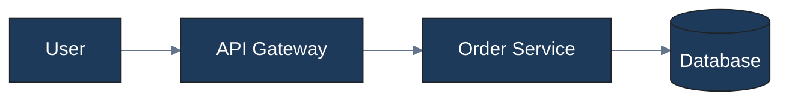
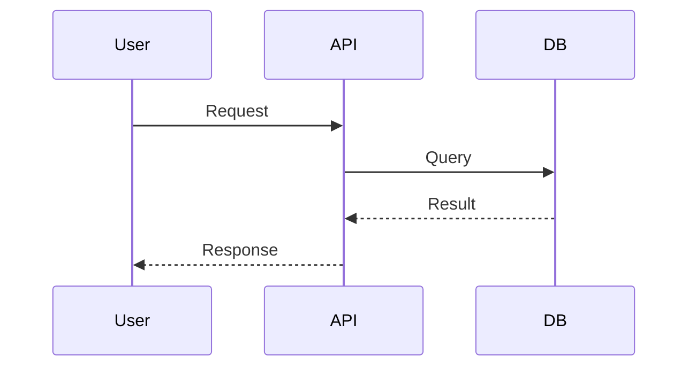
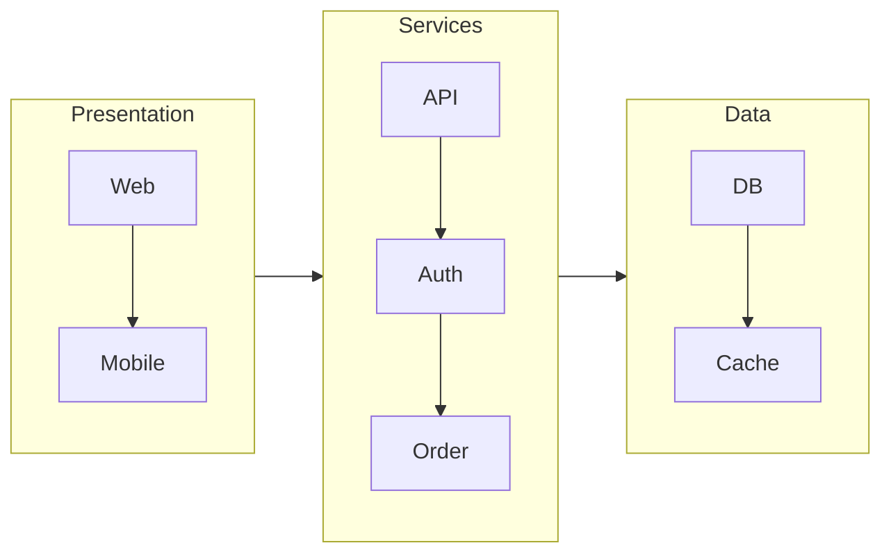

# Diagram Architect

Production-grade diagram generation with beautiful, professional themes. Creates self-contained HTML files that open in any browser.

**Three first-class rendering engines:**
- **Mermaid.js** — Client-side rendering via CDN, 10+ diagram types
- **D2** — Client-side rendering via kroki.io API, best for infrastructure/cloud layouts
- **PlantUML** — Client-side rendering via kroki.io API, best for C4 architecture diagrams

The HTML template auto-detects the engine from your source code and renders accordingly.

## Quick Start

```bash
# All engines use the SAME workflow:
# 1. Read template into memory
# 2. Replace 3 placeholders: DIAGRAM_TITLE, DIAGRAM_SUBTITLE, DIAGRAM_SOURCE
# 3. Write to a new output file

python3 scripts/generate.py \
  --title "My Diagram" \
  --source diagram.d2 \
  --output my-diagram.html

# Open in browser — it just works!
open my-diagram.html
```

## Engine Auto-Detection

The template automatically detects which engine to use based on source content:

| Source Pattern | Engine | Rendering |
|----------------|--------|-----------|
| Starts with `@startuml` | PlantUML | kroki.io API |
| Mermaid keywords (`flowchart`, `sequenceDiagram`, etc.) | Mermaid | Mermaid.js CDN |
| Anything else | D2 | kroki.io API |

## Workflow

### 1. Understand the Request
- Identify diagram type (flowchart, sequence, ER, architecture, infrastructure)
- Identify audience (technical, business, mixed)
- Identify purpose (overview, deep dive, decision support)

### 2. Select Engine

| Diagram Type | Recommended Engine | Why |
|--------------|-------------------|-----|
| Flowchart / Decision tree | Mermaid | Simple syntax, many shapes |
| Sequence diagram | Mermaid | Native support, clear syntax |
| ER diagram | Mermaid | Built-in cardinality notation |
| State diagram | Mermaid | Good transition syntax |
| Infrastructure / Cloud | **D2** | SQL-like styling, better layouts |
| C4 Architecture | **PlantUML** | C4-PlantUML library support |
| Complex architecture | **D2** or **PlantUML** | Rich styling, professional output |

### 3. Apply Design Principles
- Limit nodes: Context <10, Container <20, Component <30
- Use logical grouping with subgraphs/containers
- Clear labels: Noun phrases for systems, role names for people
- Consistent styling: Use theme colors

See [references/design-principles.md](references/design-principles.md) for guidelines.

### 4. Choose Theme

| Theme | Primary Color | Use Case |
|--------|---------------|-----------|
| Corporate | #1e3a5a (Navy) | Enterprise, B2B |
| Dark Mode | #1e293b (Dark) | Dev docs, IDE-like |
| Minimal | #374151 (Gray) | White papers, academic |
| Tech | #7c3aed (Purple) | Startups, AI/ML |
| Warm | #92400e (Brown) | Tutorials, education |

### 5. Use Azure Icons (Deployment Diagrams)

For D2 infrastructure/deployment diagrams, embed Azure service icons using `@azure:ALIAS`:

```d2
# Syntax: icon: "@azure:ALIAS"
vm: Web Server {
  icon: "@azure:vm"
  shape: image
}

lb: Load Balancer {
  icon: "@azure:load-balancer"
}

k8s: AKS Cluster {
  icon: "@azure:kubernetes"
}
```

`generate.py` automatically converts `@azure:ALIAS` → base64 SVG data URI (no internet required).

**Key aliases:**

| Category | Aliases |
|----------|---------|
| Compute | `vm`, `vm-scale-set`, `kubernetes`, `container`, `app-service`, `function` |
| Network | `vnet`, `load-balancer`, `app-gateway`, `vpn-gateway`, `firewall`, `front-door`, `dns`, `nsg`, `bastion` |
| Data | `storage`, `sql`, `cosmos-db`, `redis`, `postgresql`, `mysql`, `databricks`, `synapse` |
| Security | `key-vault`, `managed-identity` |
| Integration | `api-management`, `service-bus`, `event-hub` |
| Monitoring | `monitor`, `app-insights`, `log-analytics` |
| AI/IoT | `openai`, `machine-learning`, `iot-hub` |

See [references/azure-icons.md](references/azure-icons.md) for the complete catalog with D2 examples.

### 6. Write Diagram Source Code

**Mermaid Flowchart:**


**Mermaid Sequence:**


**D2 Infrastructure (auto-detected):**
```d2
# D2 is auto-detected when source doesn't match Mermaid or PlantUML patterns
direction: right

User: {
  shape: person
}

API Gateway: {
  style.fill: "#1e3a5a"
  style.font-color: white
}

Order Service: {
  style.fill: "#3b82f6"
  style.font-color: white
}

Database: {
  shape: cylinder
  style.fill: "#64748b"
  style.font-color: white
}

User -> API Gateway: HTTPS
API Gateway -> Order Service: gRPC
Order Service -> Database: Query
```

**PlantUML C4 (auto-detected by @startuml):**
```plantuml
@startuml
!include https://raw.githubusercontent.com/plantuml-stdlib/C4-PlantUML/master/C4_Container.puml

Person(user, "User", "End user of the system")
Container(api, "API Gateway", "Node.js", "Routes requests to services")
Container(service, "Order Service", "Java/Spring", "Handles order logic")
ContainerDb(db, "Database", "PostgreSQL", "Stores order data")

Rel(user, api, "Uses", "HTTPS")
Rel(api, service, "Calls", "gRPC")
Rel(service, db, "Reads/Writes", "SQL")
@enduml
```

### 6. Generate HTML Output

**Using the helper script (recommended):**
```bash
python3 scripts/generate.py \
  --title "CMP Platform Architecture" \
  --subtitle "System Context Overview" \
  --source diagram.d2 \
  --output /output/my-diagram.html
```

**Manual approach (Read → Replace → Write):**
```python
# Read template into memory
with open('/path/to/diagram.html', 'r') as f:
    content = f.read()

# Replace placeholders IN MEMORY (never modify template directly)
content = content.replace('DIAGRAM_TITLE', 'CMP Platform Architecture')
content = content.replace('DIAGRAM_SUBTITLE', 'System Context Overview')
content = content.replace('DIAGRAM_SOURCE', '''@startuml
!include C4_Container.puml
Person(user, "User")
Container(api, "API", "Node.js")
Rel(user, api, "Uses")
@enduml''')

# Write to NEW output file
with open('/output/my-diagram.html', 'w') as f:
    f.write(content)
```

**CRITICAL — What NOT to do:**
- DO NOT modify the original template file directly
- DO NOT use Edit tool on the template file to replace placeholders
- DO NOT lose the closing `</div>` tags after DIAGRAM_SOURCE

**Verify output:**
```bash
grep -c "DIAGRAM_TITLE\|DIAGRAM_SUBTITLE\|DIAGRAM_SOURCE" output.html
# Should output: 0 (zero remaining placeholders)
```

## Reference Patterns

### Mermaid Patterns
See [references/mermaid-patterns.md](references/mermaid-patterns.md) for:
- Flowchart syntax and styling
- Sequence diagram messages and activations
- ER diagram cardinalities
- State diagram transitions

### D2 Patterns
See [references/d2-patterns.md](references/d2-patterns.md) for:
- Infrastructure diagram patterns
- Cloud deployment layouts
- SQL-like styling syntax
- Shape types (person, cylinder, hexagon, etc.)

### PlantUML C4 Patterns
See [references/plantuml-c4.md](references/plantuml-c4.md) for:
- C4 model levels (Context/Container/Component)
- C4-PlantUML library includes
- Custom styling with skinparam
- Layout macros

## HTML Template Features

The template at `assets/templates/diagram.html` includes:

### Multi-Engine Rendering
- **Auto-detection**: Detects Mermaid/D2/PlantUML from source
- **Mermaid**: Client-side via Mermaid.js CDN
- **D2/PlantUML**: Client-side via kroki.io API (CORS-enabled)
- **Engine badge**: Shows current engine in header

### Interactive Controls
- **Theme switcher** - 5 professional themes
- **Zoom in/out** - Scale 25% to 300%
- **Reset view** - Return to 100% and center
- **Export SVG** - Download vector format
- **Export PNG** - Download raster image
- **Print** - Print-optimized layout

### Keyboard Shortcuts
- `Ctrl/Cmd +` - Zoom in
- `Ctrl/Cmd -` - Zoom out
- `Ctrl/Cmd 0` - Reset view
- `Ctrl/Cmd P` - Print

### Drag to Pan
Click and drag on the diagram to pan large diagrams.

### Error Handling
- Loading state with spinner
- Error state with retry button
- Graceful failure messages

## Quality Checklist

Before delivering a diagram, verify:

- [ ] Does it answer one clear question?
- [ ] Are node counts within limits?
- [ ] Is text readable at 100% zoom?
- [ ] Are colors applied from the theme?
- [ ] Would the target audience understand it?
- [ ] Does it work in grayscale (for printing)?
- [ ] Are related elements grouped?

## Common Patterns

### System Architecture (Mermaid)


### Cloud Infrastructure (D2)
```d2
direction: right

Cloud: {
  AWS: {
    API Gateway -> Lambda -> DynamoDB
  }
  style.fill: "#232F3E"
  style.font-color: white
}

OnPrem: {
  Server: {
    shape: hexagon
  }
  style.fill: "#64748b"
}

Cloud.AWS.Lambda -> OnPrem.Server: VPN
```

### C4 Architecture (PlantUML)
```plantuml
@startuml
!include https://raw.githubusercontent.com/plantuml-stdlib/C4-PlantUML/master/C4_Container.puml

Person(user, "User", "Application user")
Container(web, "Web App", "React", "SPA frontend")
Container(api, "API", "Node.js", "REST API")
ContainerDb(db, "Database", "PostgreSQL", "Data storage")

Rel(user, web, "Uses", "Browser")
Rel(web, api, "Calls", "HTTPS/JSON")
Rel(api, db, "Reads/Writes", "SQL")
@enduml
```

## Resources

### references/
- `engine-selection.md` - Engine decision tree and comparison
- `mermaid-patterns.md` - Mermaid syntax and examples
- `d2-patterns.md` - D2 syntax and infrastructure patterns
- `plantuml-c4.md` - C4 model with PlantUML
- `design-principles.md` - Quality guidelines and anti-patterns
- `themes.md` - 5 professional themes with color codes
- `azure-icons.md` - Azure icon catalog (43 icons, `@azure:ALIAS` usage)

### assets/templates/
- `diagram.html` - Self-contained HTML template with multi-engine support

### assets/icons/azure/
- 43 Azure SVG icons (vm, kubernetes, vnet, storage, sql, cosmos-db, etc.)
- Used via `@azure:ALIAS` syntax in D2 diagrams

### scripts/
- `generate.py` - Generate HTML from template; auto-resolves `@azure:` icons to base64
- `render.py` - (Optional) CLI tool for server-side kroki.io rendering
