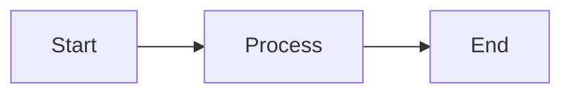
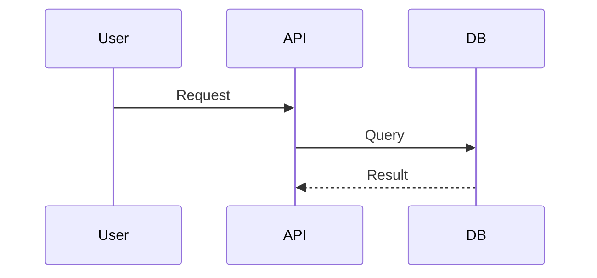
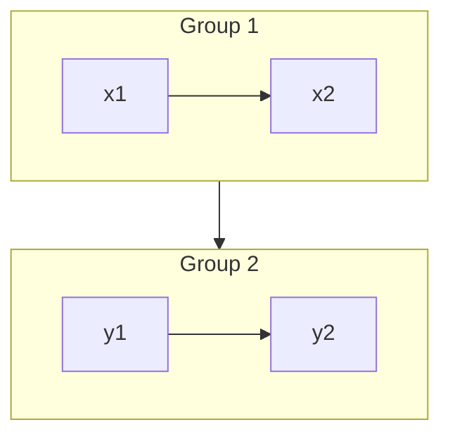

# D2 Diagram Patterns

## D2 vs Mermaid Quick Reference

| Concept | Mermaid | D2 |
|---------|---------|----|
| Node | `[Text]` | `Text:` |
| Direction | `flowchart TD` | `direction: top` |
| Subgraph | `subgraph` | `subgraph` |
| Styling | `style class` | `class.field` |
| Edge | `-->` | `->` |

## Basic Syntax

### Simple Diagram
```d2
direction: right

User -> API -> Database
```

### Node with Shape
```d2
users: Users {
  shape: person
}

database: Database {
  shape: cylinder
}

api: API {
  shape: rounded_rectangle
}

users -> api -> database
```

### Labels and Descriptions
```d2
"User Service" -> "Order Service": {
  label: "HTTP"
  style.stroke-dash: 3
}
```

---

## Architecture Diagram

### Three-Tier Architecture
```d2
direction: top

users: Users {
  shape: person
  icon: https://example.com/user.svg
}

# Frontend
frontend: Frontend {
  shape: class
  web: Web App
  mobile: Mobile App
}

# Backend
backend: Backend Services {
  shape: class
  api-gateway: API Gateway
  auth: Auth Service
  orders: Order Service
  products: Product Service
}

# Data
data: Data Layer {
  shape: class
  postgres: PostgreSQL {
    shape: cylinder
  }
  redis: Redis Cache {
    shape: cylinder
  }
  s3: S3 Storage {
    shape: cylinder
  }
}

# Connections
users -> frontend.web
users -> frontend.mobile
frontend.web -> backend.api-gateway: HTTPS
frontend.mobile -> backend.api-gateway: HTTPS
backend.api-gateway -> backend.auth: gRPC
backend.api-gateway -> backend.orders: gRPC
backend.api-gateway -> backend.products: gRPC
backend.orders -> data.postgres: SQL
backend.auth -> data.redis: TCP
backend.products -> data.s3: S3 Protocol
```

### Cloud Infrastructure
```d2
direction: right

# External
users: End Users
internet: Internet

# VPC
vpc: AWS VPC {
  shape: box3d

  # Public Subnet
  public: Public Subnet {
    shape: box
    alb: Load Balancer
    nat: NAT Gateway
  }

  # Private Subnets
  private: Private Subnets {
    shape: box
    web: Web Servers
    app: App Servers
  }

  # Data Layer
  data: Data Layer {
    shape: box
    rds: RDS
    elasticache: ElastiCache
  }
}

users -> internet -> alb
alb -> web
web -> app -> rds
app -> elasticache
```

---

## Grouping and Layout

### Subgraph
```d2
direction: top

subgraph client {
  shape: box
  style.fill: lightblue
  web: Web
  mobile: Mobile
}

subgraph server {
  shape: box
  style.fill: lightgreen
  api: API Gateway
  db: Database
}

web -> api
mobile -> api
api -> db
```

### SQL Class Syntax
```d2
direction: right

services.*.style.stroke-dash: 3
data.*.shape: cylinder

services: {
  web: Web Server
  api: API Service
  worker: Worker
}

data: {
  primary: Primary DB
  replica: Read Replica
}

services.* -> data.primary
data.replica -> data.primary: {
  style.stroke-dash: 3
  label: "replication"
}
```

---

## Styling

### Colors
```d2
direction: right

# Using named colors
red-node: Red { style.fill: red }

# Using hex codes
blue-node: Blue { style.fill: #3b82f6 }

# Using CSS-like values
green-node: Green { style.fill: rgb(34, 197, 94) }

red-node -> blue-node -> green-node
```

### Stroke Styles
```d2
direction: right

a -> b: solid
a -> c: { style.stroke-dash: 3 }
a -> d: { style.stroke-dasharray: [5, 5, 15, 5] }
a -> e: { style.stroke-width: 3 }
```

### Icon Support
```d2
direction: right

user: User {
  icon: https://icons.terrastruct.com/dev/regular/Person.svg
  icon-width: 60
  icon-height: 60
}

server: Server {
  icon: https://icons.terrastruct.com/dev/regular/Server.svg
}

user -> server
```

---

## Best Practices

1. **Use `direction` at the top** - Set overall flow direction once
2. **Group related nodes** - Use subgraphs for logical organization
3. **Keep nodes under 15-20** - Split complex diagrams into multiple diagrams
4. **Use consistent naming** - kebab-case for IDs, readable labels
5. **Add meaningful labels** - Edge labels explain the relationship
6. **Leverage SQL class syntax** - `group.*` syntax for bulk styling

---

## Rendering via CLI

```bash
# Render to SVG
d2 diagram.d2 diagram.svg

# With layout engine (elk, tala)
d2 diagram.d2 diagram.svg -l elk

# Dark theme
d2 diagram.d2 diagram.svg --theme 1

# Render to PNG
d2 diagram.d2 diagram.png
```

---

## Rendering via kroki.io

```bash
# Render to SVG
curl -X POST -d "@diagram.d2" https://kroki.io/d2/svg

# Render to PNG
curl -X POST -d "@diagram.d2" https://kroki.io/d2/png
```

---

## Mermaid to D2 Migration

### Flowchart
**Mermaid:**


**D2:**
```d2
direction: right
Start -> Process -> End
```

### Sequence
**Mermaid:**


**D2:**
```d2
direction: right
User -> API: Request
API -> DB: Query
DB -> API: Result
```

### Grouping
**Mermaid:**


**D2:**
```d2
direction: top
x1 -> x2
y1 -> y2
group1: {
  x1
  x2
  shape: box
}
group2: {
  y1
  y2
  shape: box
}
group1 -> group2
```
