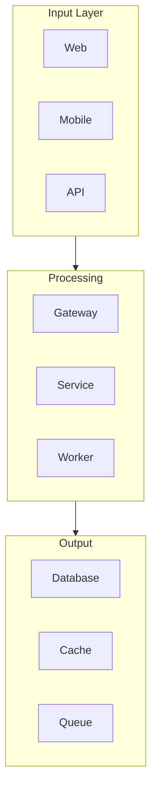
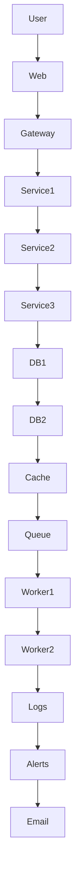
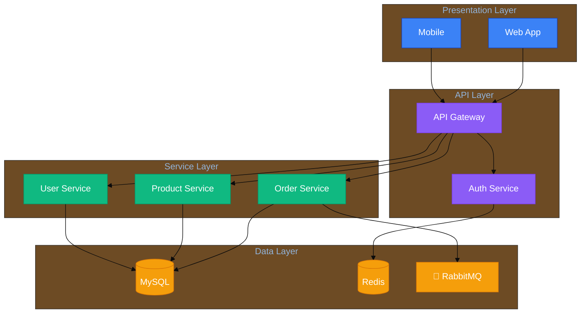

# Diagram Design Principles

## Core Principles

### 1. Clarity Over Complexity
- If a diagram needs a legend longer than 3 lines, simplify it
- If text needs to be smaller than 10px to fit, split the diagram
- If arrows cross more than 3 times, reconsider the layout

### 2. One Diagram, One Purpose
- Each diagram should answer a single question
- Don't mix architecture with deployment
- Don't mix data flow with sequence

### 3. Progressive Disclosure
- Start with context (what, who, why)
- Move to containers (how many, what types)
- Details only when needed (components, code)

---

## Node Limits

| Diagram Type | Recommended Max | Hard Limit |
|--------------|-----------------|------------|
| System Context | 6-8 elements | 10 |
| Container Diagram | 10-15 elements | 20 |
| Component Diagram | 15-20 elements | 30 |
| Flowchart | 10-15 nodes | 25 |
| Sequence Diagram | 5-8 participants | 12 |
| ER Diagram | 6-10 entities | 15 |

**When exceeding limits:**
1. Group related elements
2. Split into multiple diagrams
3. Create a parent diagram that links to children

---

## Grouping and Hierarchy

### Logical Grouping

### When to Group
- Related components that share a common purpose
- Elements from the same subsystem
- Components with similar technology
- Security boundaries (DMZ, internal, secure)

### When NOT to Group
- Just because there are many items
- When groups overlap significantly
- When the group doesn't have a clear name

---

## Labeling Guidelines

### Good Labels
- ✅ "API Gateway" - Clear, concise
- ✅ "User Service" - Purpose-driven
- ✅ "HTTPS" - Protocol and transport
- ✅ "Publishes: Device Events" - Action + Object

### Bad Labels
- ❌ "A" - No context
- ❌ "Service1", "Service2" - Generic
- ❌ "It does stuff" - Too vague
- ❌ "User->API: Request" in multiple places - Redundant

### Naming Conventions
- **Systems**: Noun phrase (e.g., "Order Service", "Payment Gateway")
- **People**: Role-based (e.g., "Customer", "Admin", "Operator")
- **Databases**: Technology + Purpose (e.g., "PostgreSQL: Orders")
- **Edges**: Action or Protocol (e.g., "HTTPS", "Publishes", "Invokes")

---

## Color Usage

### Color Hierarchy
1. **Primary** - Main elements (systems, containers) - 1-2 colors
2. **Secondary** - Supporting elements (databases, queues) - 1-2 colors
3. **Accent** - Highlights (alerts, external systems) - 1 color
4. **Status** - Green (success), Red (error), Yellow (warning) - As needed

### Color Guidelines
- **Don't use** > 5 distinct colors in one diagram
- **Use** color consistently (same type = same color)
- **Consider** color blindness (use patterns/labels too)
- **Match** brand colors when applicable

### Color Harmony

---

## Layout Guidelines

### Direction Choice
- **Top-Down** for: Hierarchies, process flows, time-based sequences
- **Left-Right** for: Time lines, wide components, data pipelines
- **Avoid**: Mixing directions in one diagram

### Spacing
- Consistent margins between groups
- Equal spacing between peer elements
- Leave room for labels on edges
- Don't crowd corners

### Alignment
- Align related elements
- Use grid where possible
- Center text within nodes
- Minimize diagonal edges

---

## Edge Guidelines

### Clear Connections
- Straight lines for direct relationships
- Curved lines for flows/routing
- Dashed for optional/async
- Arrows should point in flow direction

### Labeling Edges
- Only label when meaning isn't obvious
- Short labels (2-3 words max)
- Place labels where they don't overlap
- Use consistent terminology

### Crossing Edges
- Minimize crossings
- If unavoidable, use different colors/styles
- Consider restructuring to avoid
- Use curved lines for aesthetic crossing

---

## Accessibility

### Color Blindness
- Don't rely solely on color to differentiate
- Use patterns (stripes, dots) for critical distinctions
- Include text labels for colors in legend
- Test with color blindness simulators

### Text Readability
- Minimum 10px text
- High contrast ratios (4.5:1 for text)
- Avoid pure black on pure white
- Use appropriate font weights

### Export Considerations
- Ensure diagrams work in grayscale
- Test at different zoom levels
- Verify print output
- Check export formats (SVG/PNG)

---

## Anti-Patterns

### Common Mistakes
1. **Everything on one page** - Result: Unreadable mess
2. **Tiny text to fit** - Result: Defeats purpose
3. **No context** - Result: Who cares what this shows?
4. **Too technical** - Result: Wrong audience confusion
5. **Mixed abstraction levels** - Result: Inconsistent understanding

### Before Finalizing Checklist
- [ ] Does this answer one clear question?
- [ ] Is there a title explaining the purpose?
- [ ] Are node counts within limits?
- [ ] Is text readable at 100% zoom?
- [ ] Are colors used consistently?
- [ ] Would this make sense to the target audience?
- [ ] Is there a legend for non-obvious symbols?
- [ ] Would it work in grayscale?

---

## Example: Good vs Bad

### Bad: Everything on One Page

### Good: Layered Architecture

