# Mermaid Diagram Patterns

## Flowchart

### Basic Structure
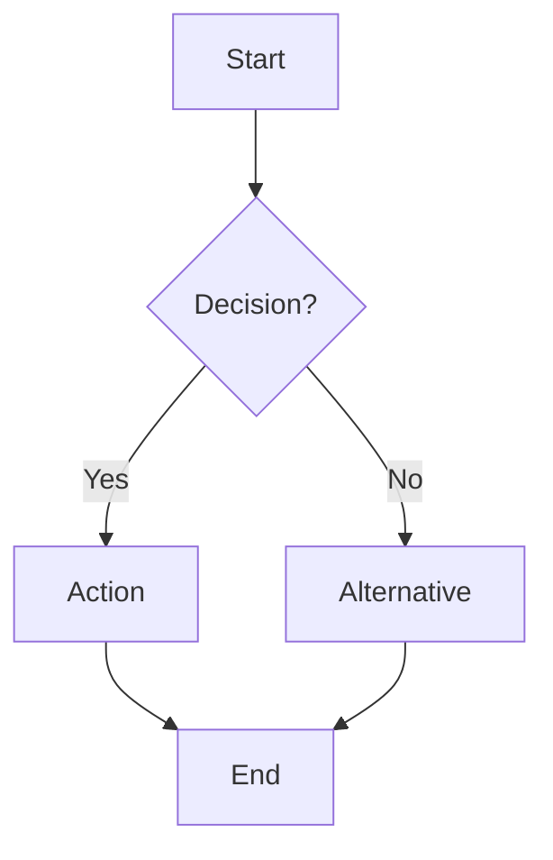

### Direction
- `TD` = Top-Down
- `LR` = Left-Right
- `BT` = Bottom-Top
- `RL` = Right-Left

### Node Shapes
```
[Text]          Rectangle
(Text)          Rounded
([Text])        Stadium
{Text}          Diamond
[[Text]]        Subroutine
[(Text)]        Cylinder (database)
((Text))        Circle
>Text]          Flag
```

### Styling
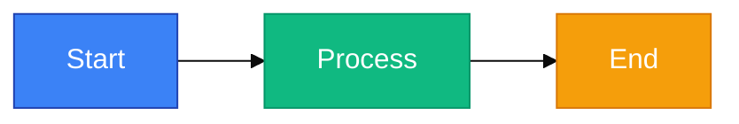

### Grouping
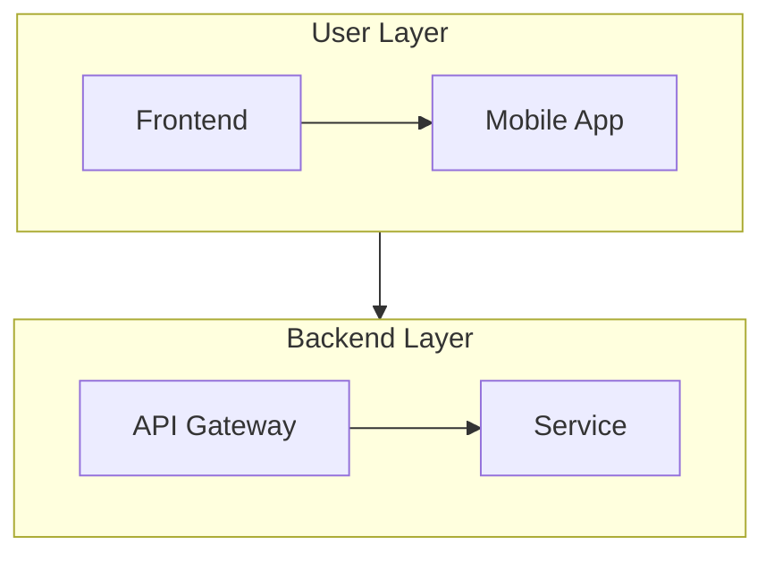

---

## Sequence Diagram

### Basic Structure
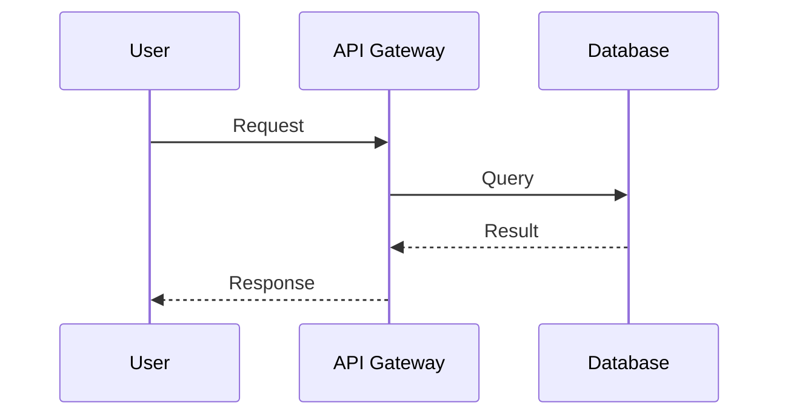

### Messages
- `->>`  Synchronous request
- `-->>` Synchronous response
- `->`   Asynchronous message
- `-->`  Asynchronous response
- `--`   Dotted line (no response)

### Activations and Loops
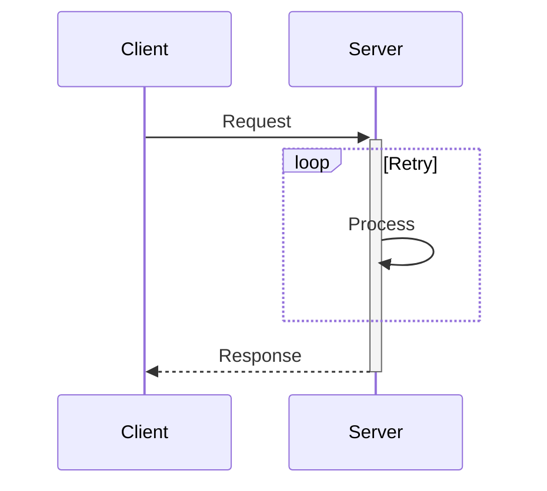

### Grouping
- `rect` - Group with box
- `alt/else` - Conditional blocks
- `opt` - Optional block
- `loop` - Loop block
- `par/and` - Parallel execution

---

## Entity Relationship Diagram

### Basic Structure
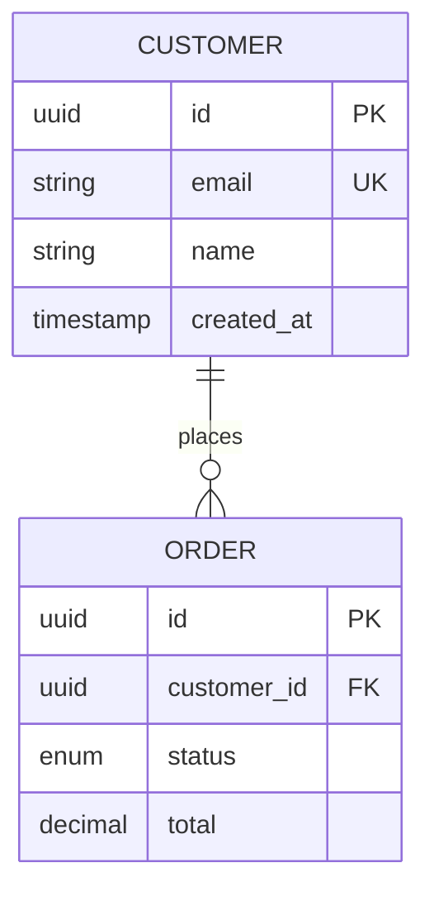

### Cardinalities
- `||--||`  One to One
- `||--o{`  One to Many (optional)
- `||--|{`  One to Many (required)
- `}o--||`  Many to One (optional)
- `}|--||`  Many to One (required)
- `}o--o{`  Many to Many (both optional)
- `}|--|{`  Many to Many (both required)

---

## State Diagram

### Basic Structure
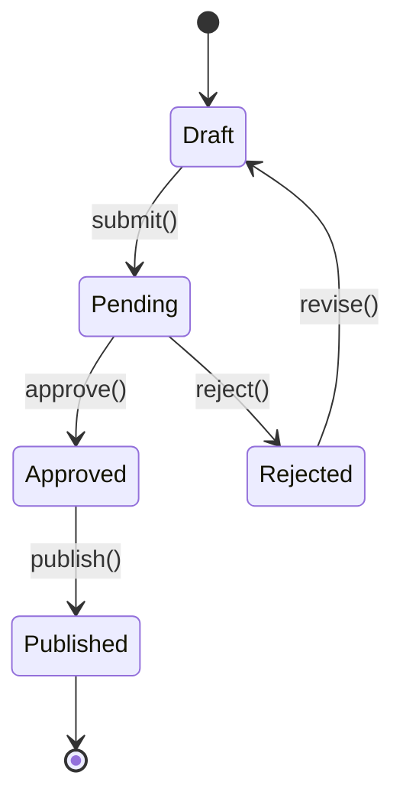

### Choices
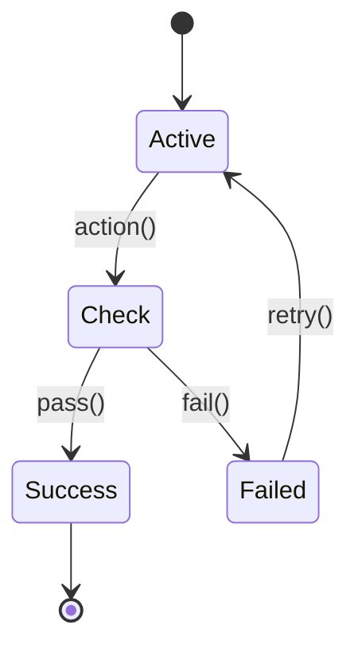

---

## Class Diagram

### Basic Structure
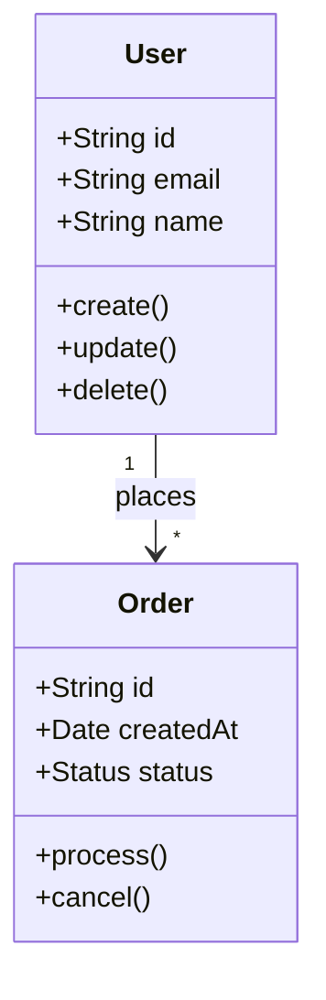

### Visibility
- `+`  Public
- `-`  Private
- `#`  Protected
- `~`  Package

### Relationships
- `-->`   Association (general)
- `*--`   Composition (owns)
- `o--`   Aggregation (has)
- `<|--`  Inheritance (extends)
- `..|>`  Implementation (implements)
- `..>`   Dependency (uses)

---

## Mind Map

### Basic Structure
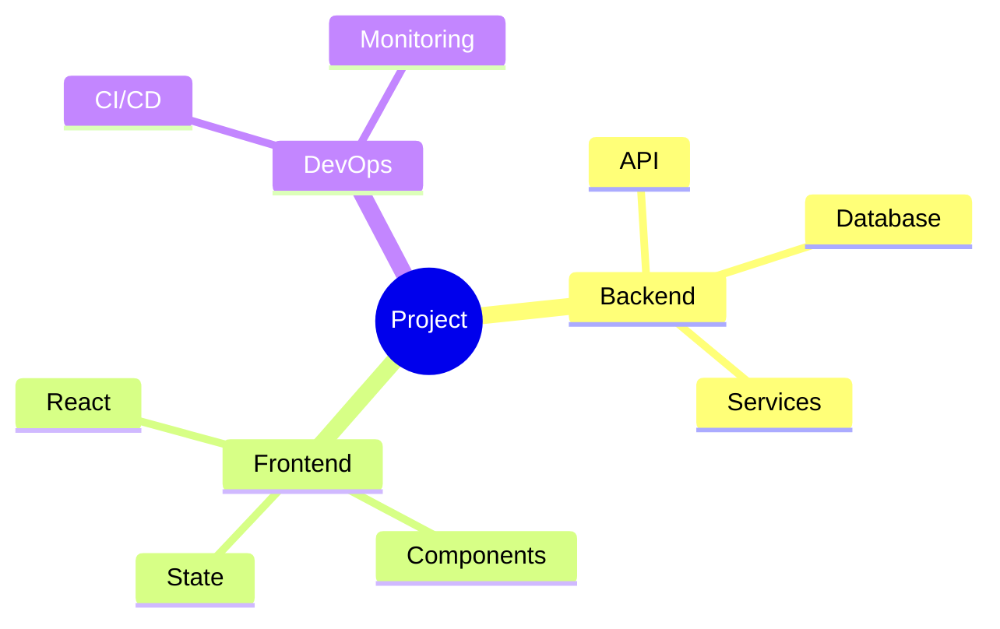

---

## Gantt Chart

### Basic Structure
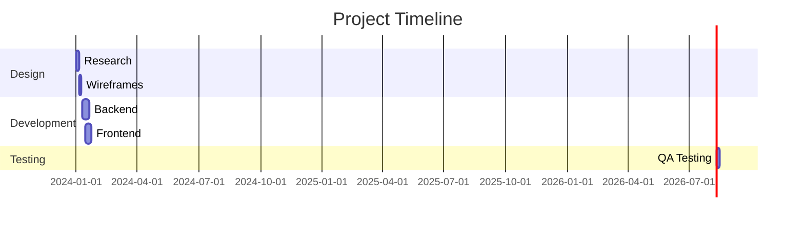

---

## Quality Examples

### Bad: Too Many Nodes
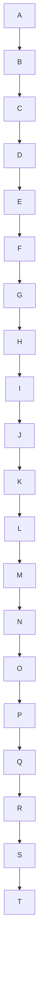

### Good: Logical Grouping
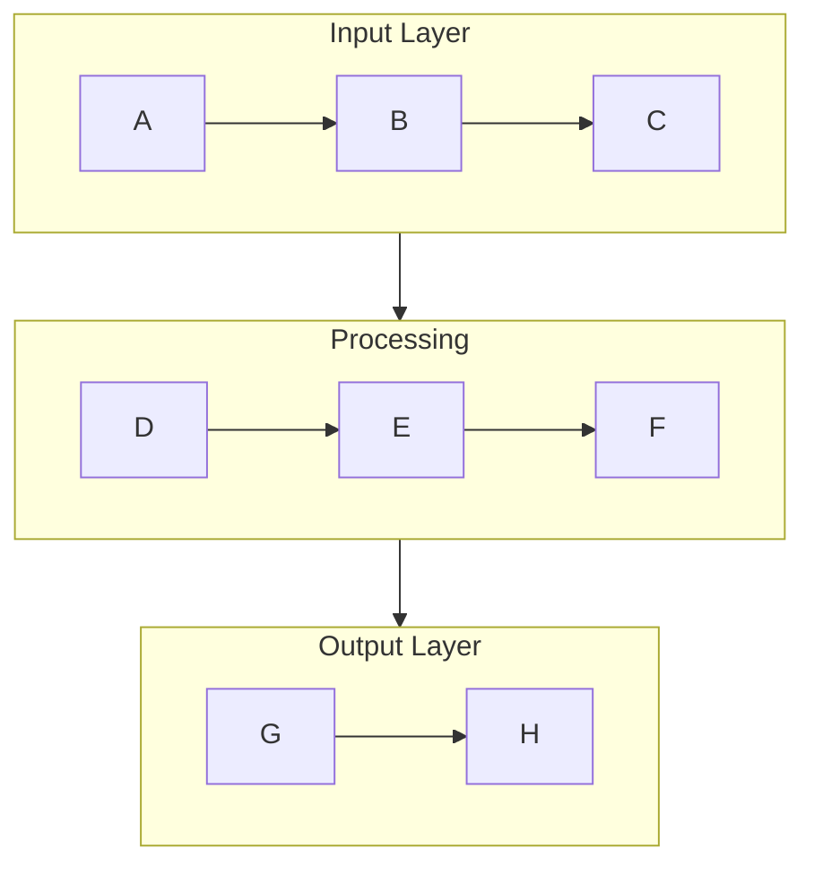

### Excellent: Clear Labels + Visual Hierarchy
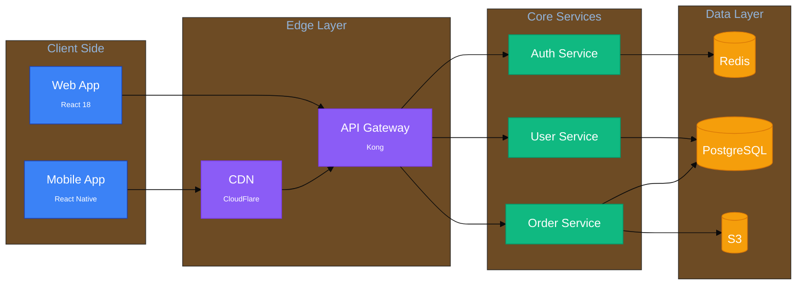

## Theme Variables Reference

```javascript
{
  primaryColor: '#1e3a5a',
  primaryTextColor: '#ffffff',
  primaryBorderColor: '#1e40af',
  lineColor: '#5c6370',
  secondaryColor: '#f0f0f0',
  tertiaryColor: '#e8e8e8',
  background: '#ffffff',
  edgeLabelBackground: '#f1f5f9',
  actorBkg: '#3b82f6',
  actorBkgColor: '#3b82f6',
  actorTextColor: '#ffffff',
  actorBorder: '#1e40af',
  labelBoxBkgColor: '#3b82f6',
  labelTextColor: '#ffffff',
  noteBkgColor: '#fef3c7',
  noteTextColor: '#92400e',
  noteBorderColor: '#d97706'
}
```
